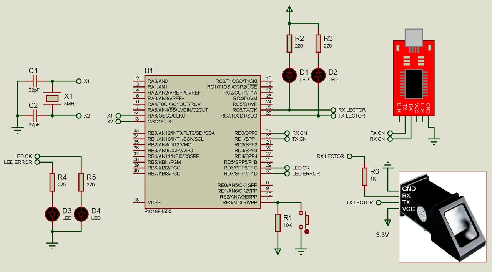

# Proyecto de Refactorización y Control de Acceso con Huella Digital

## Descripción del Proyecto

Este proyecto tiene como objetivo principal la refactorización del código existente para mejorar su estructura y legibilidad. Además, se implementará una interfaz de usuario intuitiva para facilitar el uso del sistema. La funcionalidad principal del proyecto será controlar el acceso mediante la lectura de huellas dactilares.

## Funcionalidades

- Refactorización del código existente para mejorar su mantenibilidad y eficiencia.
- Implementación de una interfaz de usuario amigable para facilitar la interacción con el sistema.
- Integración con el microcontrolador PIC18F4550 para gestionar la lógica del sistema.
- Utilización de un lector de huellas dactilares para autenticar a los usuarios y controlar el acceso al sistema.
- Al ser auntenticado en el sistema mover un motor 90 grados.

## Objetivos

- Mejorar la estructura del código para facilitar su comprensión y mantenimiento.
- Proporcionar una experiencia de usuario intuitiva y eficiente.
- Garantizar la seguridad y el control de acceso al sistema mediante la autenticación biométrica.
- Armar el circuito propuesto

## Tecnologías Utilizadas

- Microcontrolador PIC18F4550
- Lector de Huellas Dactilares
- Lenguaje de Programación C
- Plataforma de Desarrollo (por definir)

## Contribución

¡Las contribuciones son bienvenidas! Si deseas contribuir a este proyecto, por favor sigue estos pasos:

1. Haz un fork del repositorio.
2. Crea una rama nueva (`git checkout -b feature/nueva-caracteristica`).
3. Realiza tus cambios y realiza un commit explicativo (`git commit -am 'Agrega una nueva característica: X'`).
4. Empuja tus cambios a la rama (`git push origin feature/nueva-caracteristica`).
5. Abre un Pull Request.

## Tareas Pendientes

Aquí se listan las tareas que quedan por completar:

- Estado de la Tarea
  - ✅ -> Tarea Finalizada
  - ❌ -> Tarea Pendiente

1. [ ] Refactorizacion de codigo.
2. [ ] Creacion del Circuito.
3. [ ] Verificacion Del Proyecto con todas sus implementaciones.
