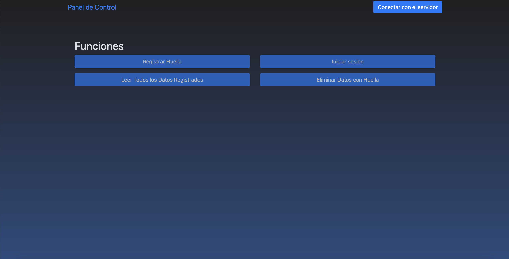
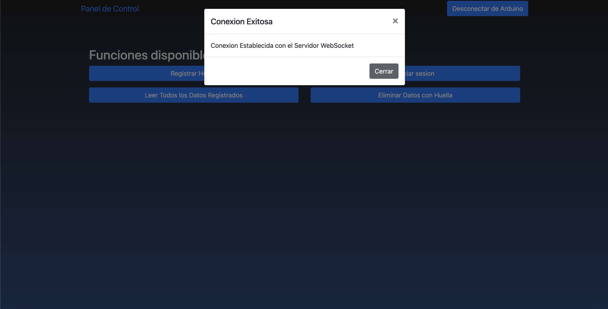
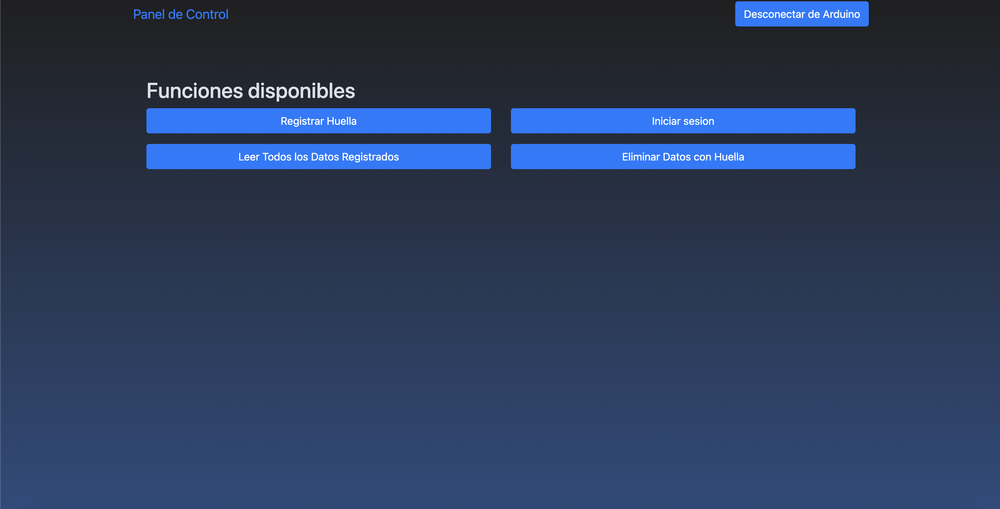
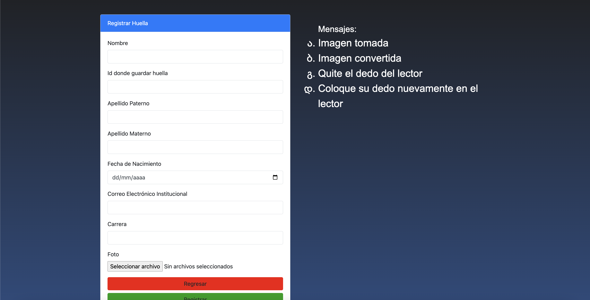
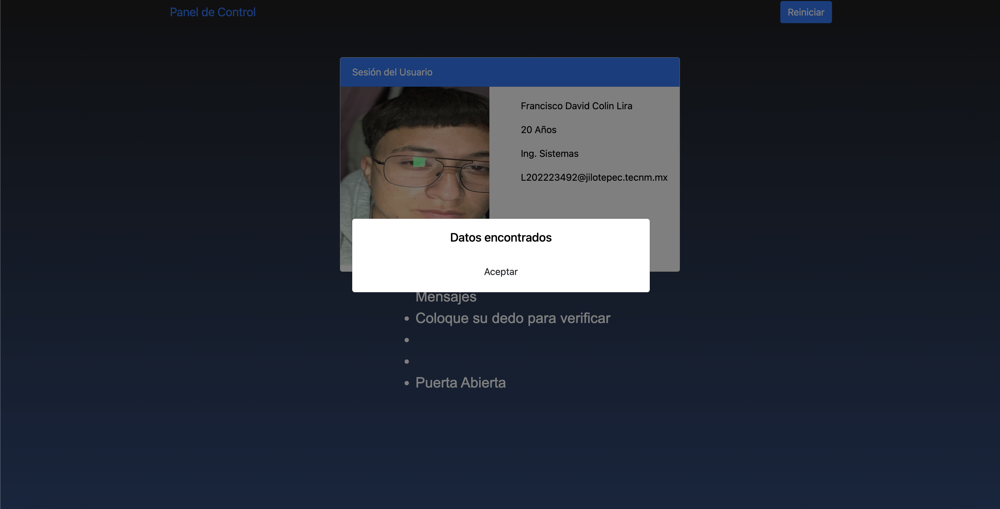
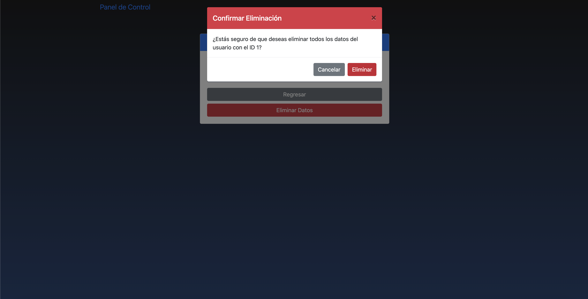
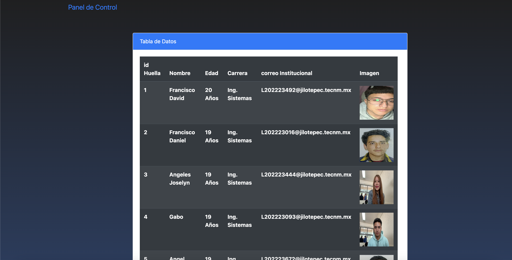

# Proyecto Lector de huellas con Arduino integrado con una Web

## Descripción

Este proyecto fue realizado con una API con la cual al escuchar los eventos y datos que mandaba el arduino al servidor node mandabamos peticiones a la API y asi mismo realizabamos la accione necesaria, tambien aqui cuando el usuario inicia sesion con su huella un Servo Motor realiza un accion el cual es mover su eje 90 grados y regresarlo a la posicion de cerrado

## Tecnologías Utilizadas

- **Backend**: Node.js, Express, WebSockets, Arduino
- **Base de Datos**: MySQL.
- **Frontend**: HTML, CSS, JavaScript.
- **Herramientas**: Git, Postman para pruebas

## Instalación

1. Clona el repositorio:
    ```bash
    git clone https://github.com/itsFDavid/Proyecto-Lector-Huellas.git
    ```
2. Navega al directorio del proyecto:
    ```bash
    cd tu-repositorio
    ```
3. Instala las dependencias del backend:
    ```bash
    npm install
    ```
4. Configura las variables de entorno. Crea un archivo `.env` en la raíz del proyecto y añade las siguientes variables:
    ```env
    DB_HOST=tu_host_de_bd
    DB_USER=tu_usuario_de_bd
    DB_PASS=tu_contraseña_de_bd
    DB_NAME=tu_nombre_de_bd
    PORT=puerto_deseado
    ```
5. Configura el archivo en [arduinoConnection.js](Proyecto-lector-huella/utils/arduinoConnection.js) con tu puerto serial al cual esta conectado tu arduino y el baudRate en el cual este configurado
6. Inicia el servidor:
    ```bash
    npm start
    ```

## Uso

## Vistas del Frontend

A continuación se muestran capturas de pantalla de la interfaz de usuario:

### Vista Panel Sin Conexion


## Conexion con el Servidor 


## Vista Panel Conectado



### Formulario de Creación de Usuario


### Inicio de Sesion


### Eliminaicon de Usuario


### Tabla de Datos


## Prototipo del lector de huellas fisico
Este es el prototipo del lector de huellas con el cual realizamos las lecturas y capturas de huella

## Prototipo Lector de Huellas


## Contribución

1. Haz un fork del repositorio.
2. Crea una rama para tu característica o corrección de errores (`git checkout -b nombre-rama`).
3. Haz commit de tus cambios (`git commit -am 'Agrega nueva característica'`).
4. Haz push a la rama (`git push origin nombre-rama`).
5. Abre un Pull Request.


## Contacto

- **Nombre**: Francisco David
- **Email**: FDavid04@icloud.com
- **GitHub**: [itsFDavid](https://github.com/itsFDavid)

